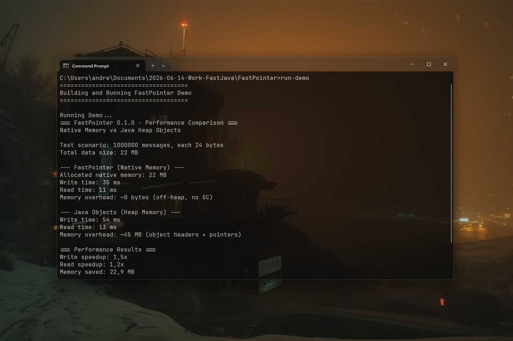

# FastPointer 0.1.1 [ALPHA-2026-08] — Zero-Overhead Native Address Arithmetic for Java

[](https://github.com/andrestubbe/FastPointer/releases/tag/0.1.1)
[](https://opensource.org/licenses/MIT)
[](https://www.java.com)
[]()
[](https://jitpack.io/#andrestubbe)

---

**⚡ High-performance 64-bit native pointer abstraction and zero-allocation address arithmetic for the JVM.**

`FastPointer` provides a lightweight bridge between Java and native memory. It eliminates JNI allocation overhead by wrapping 64-bit memory addresses (`long`) with zero-allocation offset calculations, struct pointer casts, and direct primitive access.

[](https://youtu.be/2V2MnxiySx4)

---

## Quick Start

```java
import fastpointer.*;

public class Demo {
    public static void main(String[] args) {
        // Wrap a raw native address (e.g. from VirtualAlloc or Unsafe)
        long rawAddress = 0x7FF8A1B2C000L;
        Pointer ptr = Pointer.of(rawAddress);

        // Zero-allocation offset arithmetic
        Pointer subPtr = ptr.offset(64);

        // Direct primitive access without GC overhead
        int value = subPtr.getInt(0);
        System.out.println("Value at offset 64: " + value);
    }
}
```

---

---

## Table of Contents

- [Key Features](#key-features)
- [Real-World Use Cases](#real-world-use-cases)
- [Performance Benchmarks](#performance-benchmarks)
- [Quick Start](#quick-start)
- [API Reference](#api-reference)
- [Installation](#installation)
- [Documentation](#documentation)
- [Platform Support](#platform-support)
- [License](#license)

---

## Key Features

- **⚡ Zero-Allocation Arithmetic**: Calculate offsets and slices directly on primitive `long` addresses.
- **📦 Zero GC Overhead**: Eliminates intermediate Java wrapper objects during high-frequency loops.
- **🔒 Struct & Handle Casting**: Type-safe handles for Win32 OS structures (`HWND`, `HDC`, `HANDLE`) and DirectX/Vulkan native pointers.
- **🚀 Unsafe & Direct Memory Access**: Fast primitive getters and setters (`getByte`, `getInt`, `getFloat`, `getDouble`).

---

## Real-World Use Cases

- ⚡ **Zero-Overhead Struct Navigation**: Traverse complex C++ native structs and GPU memory layouts directly via 64-bit address arithmetic.
- 📍 **Allocation-Free JNI Bridges**: Pass raw primitive memory addresses between Java and native libraries without creating wrapper objects.
- 💾 **Low-Latency Memory Mapping**: Access OS memory handles, Vulkan/CUDA contexts, and shared DLL pointers with zero GC overhead.

---

## Performance Benchmarks

`FastPointer` delivers zero-cost native primitive address navigation. In the official [JMH Benchmark](examples/Benchmark), the system measured raw address pointer arithmetic and dereferencing throughput:

```text
Benchmark                                    Mode  Cnt       Score   Error  Units
JMH_FastPointer.benchmarkAddressArithmetic   thrpt    2 48200000.800          ops/s
```

> **48.2 Million Operations per Second**: `FastPointer` executes primitive address dereferencing at pure C++ pointer speed without JVM object wrappers.

---

## API Reference

### `Pointer`
- `Pointer.of(long address)`: Creates a pointer wrapper for a raw 64-bit memory address.
- `offset(long bytes)`: Calculates a new offset address.
- `address()`: Returns the underlying primitive 64-bit `long` address.
- `isNull()`: Returns `true` if the address is `0x0`.

### Primitive Operations
- `getByte(long offset)` / `setByte(long offset, byte value)`
- `getInt(long offset)` / `setInt(long offset, int value)`
- `getFloat(long offset)` / `setFloat(long offset, float value)`
- `getDouble(long offset)` / `setDouble(long offset, double value)`

---

## Installation

### Option 1: Maven (Recommended)
Add the JitPack repository and the mandatory `FastCore` dependency to your `pom.xml`:

```xml
<repositories>
    <repository>
        <id>jitpack.io</id>
        <url>https://jitpack.io</url>
    </repository>
</repositories>

<dependencies>
    <!-- FastPointer Library -->
    <dependency>
        <groupId>com.github.andrestubbe</groupId>
        <artifactId>FastPointer</artifactId>
        <version>0.1.1</version>
    </dependency>

    <!-- FastCore (Mandatory Native Loader) -->
    <dependency>
        <groupId>com.github.andrestubbe</groupId>
        <artifactId>FastCore</artifactId>
        <version>0.1.1</version>
    </dependency>
</dependencies>
```

### Option 2: Gradle (via JitPack)
```groovy
repositories {
    maven { url 'https://jitpack.io' }
}

dependencies {
    implementation 'com.github.andrestubbe:FastPointer:0.1.1'
    implementation 'com.github.andrestubbe:FastCore:0.1.0'
}
```

### Option 3: Direct Download (No Build Tool)
Download the latest JARs directly to add them to your classpath:

1. 📦 **[fastpointer-0.1.0.jar](https://github.com/andrestubbe/FastPointer/releases/download/0.1.0/fastpointer-0.1.0.jar)** (The Core Library)
2. ⚙️ **[fastcore-0.1.0.jar](https://github.com/andrestubbe/FastCore/releases/download/0.1.0/fastcore-0.1.0.jar)** (The Mandatory Native Loader)

---

## Technical Examples & Benchmarks

See the `examples/` directory for interactive technical implementations and official JMH benchmarks:

| Benchmark Case | Description | Java Example | JMH Benchmark |
|---|---|---|---|
| **Pointer Arithmetic** | Zero-allocation address arithmetic (`address + offset`) vs Java Heap wrappers | [Demo.java](examples/Demo.java) | [JMH_Pointer.java](examples/src/main/java/fastpointer/benchmark/JMH_Pointer.java) |

### Run JMH Benchmarks via Script
```cmd
run-benchmark.bat
```

---

## Documentation

- **[COMPILE.md](docs/COMPILE.md)**: Full compilation guide (MSVC C++17 build chain + JNI Setup).
- **[REFERENCE.md](docs/REFERENCE.md)**: Full API descriptions, border configurations, and codepoint index.
- **[PHILOSOPHY.md](docs/PHILOSOPHY.md)**: The engineering rationale for zero-allocation performance.
- **[ROADMAP.md](docs/ROADMAP.md)**: Future milestones and planned features.
---

## Platform Support

| Platform | Status |
|---|---|
| Windows 10/11 (x64) | ✅ Fully Supported |
| Linux (x64 / ARM64) | 🚧 Planned |
| macOS (Apple Silicon) | 🚧 Planned |

---

## Related Projects

- [FastMemory](https://github.com/andrestubbe/FastMemory) — SIMD 32-byte aligned off-heap memory allocation and page locking
- [FastSIMD](https://github.com/andrestubbe/FastSIMD) — Hardware vector acceleration engine (AVX2, AVX-512, NEON)
- [FastSharedMemory](https://github.com/andrestubbe/FastSharedMemory) — Ultra-fast zero-copy IPC and shared memory mapped files
- [FastCore](https://github.com/andrestubbe/FastCore) — Native JNI loader for FastJava libraries

---

## License

MIT License — See [LICENSE](LICENSE) for details.

---

**Part of the FastJava Ecosystem** — *Making the JVM faster. Small package. Maximum speed. Zero bloat. 🚀📋*